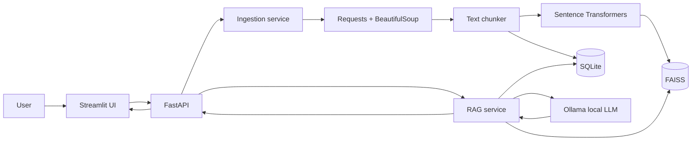

# Architecture Diagram

```mermaid
flowchart LR
    U[User] --> UI[Streamlit UI]
    UI --> API[FastAPI]
    API --> ING[Ingestion service]
    ING --> SCR[Requests + BeautifulSoup]
    SCR --> CH[Text chunker]
    CH --> EMB[Sentence Transformers]
    EMB --> VS[(FAISS)]
    CH --> DB[(SQLite)]
    API --> RAG[RAG service]
    RAG --> VS
    RAG --> DB
    RAG --> LLM[Ollama local LLM]
    LLM --> RAG
    RAG --> API --> UI
```
