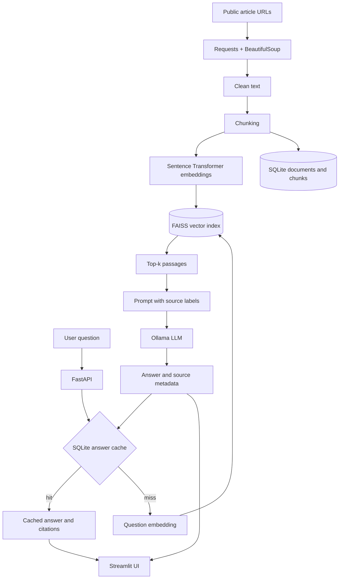

# Data Flow Diagram (DFD)

```mermaid
flowchart TD
    A[Public article URLs] --> B[Requests + BeautifulSoup]
    B --> C[Clean text] --> D[Chunking]
    D --> E[Sentence Transformer embeddings]
    D --> F[(SQLite documents and chunks)]
    E --> G[(FAISS vector index)]
    H[User question] --> I[FastAPI]
    I --> J{SQLite answer cache}
    J -- hit --> K[Cached answer and citations]
    J -- miss --> L[Question embedding]
    L --> G --> M[Top-k passages]
    M --> N[Prompt with source labels] --> O[Ollama LLM]
    O --> P[Answer and source metadata] --> J
    P --> Q[Streamlit UI]
    K --> Q
```
